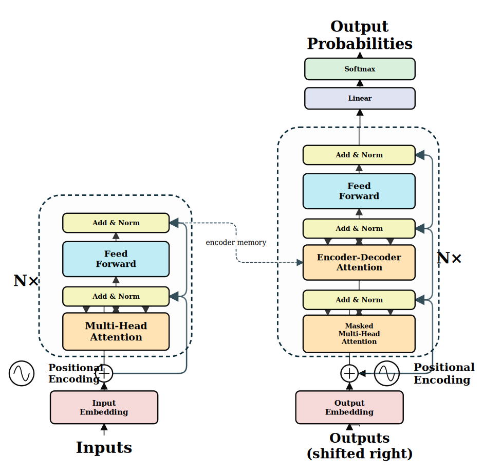
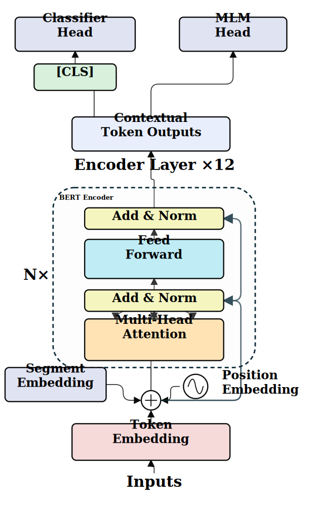
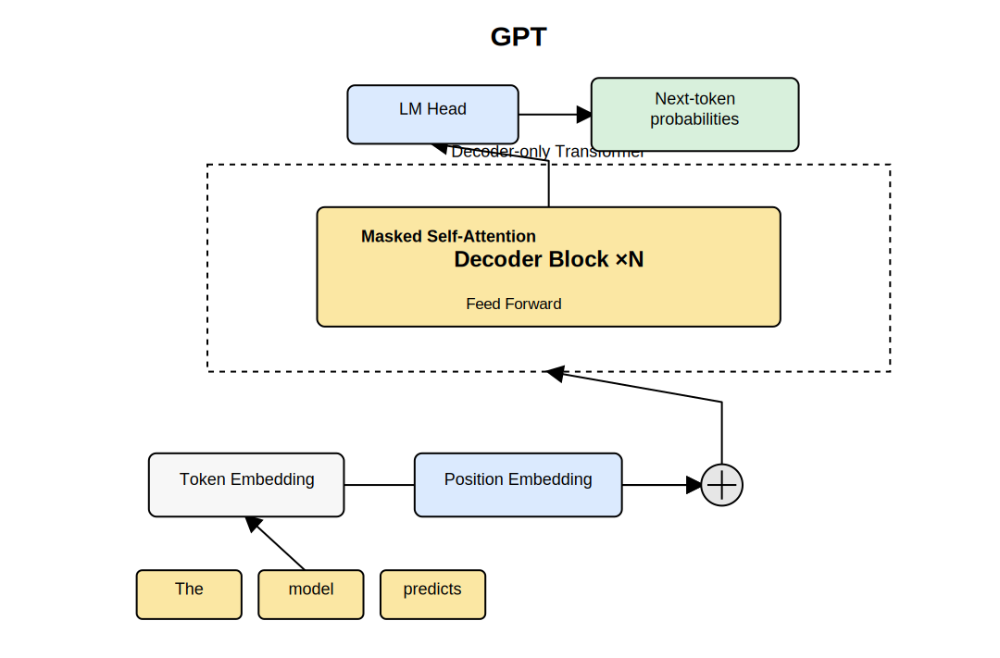
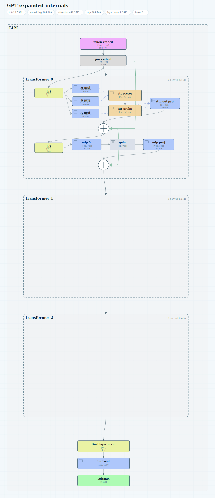
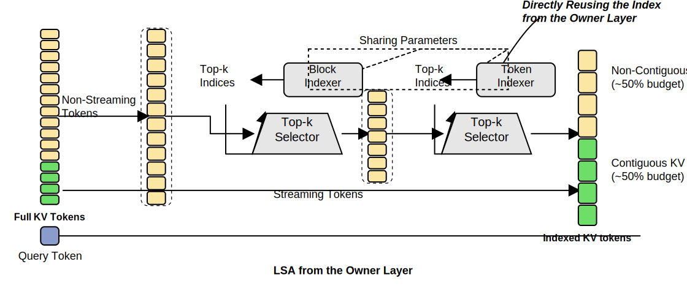
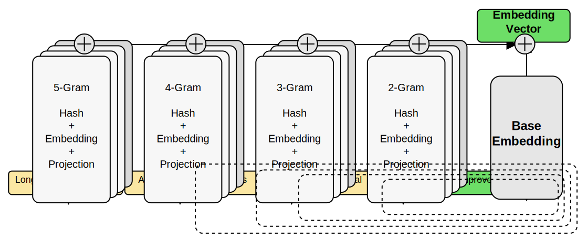
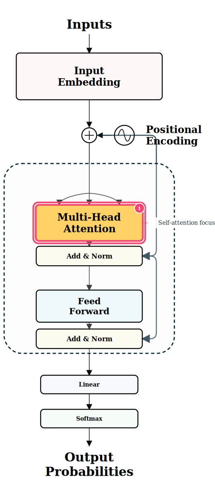
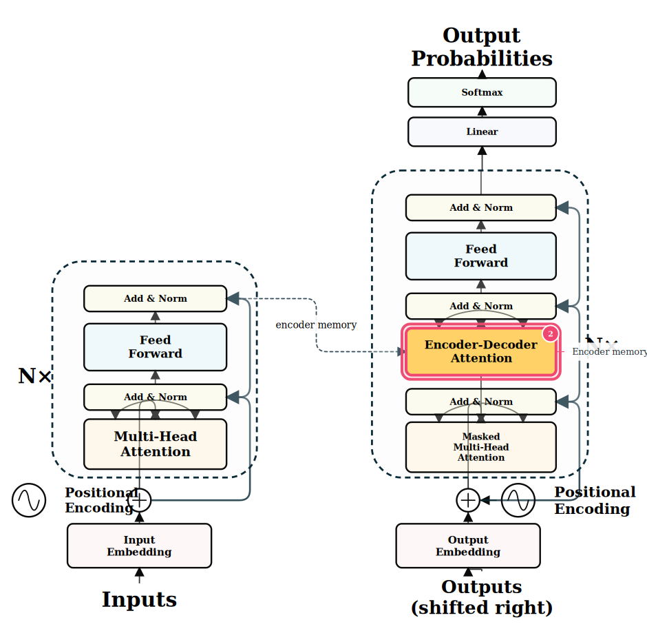
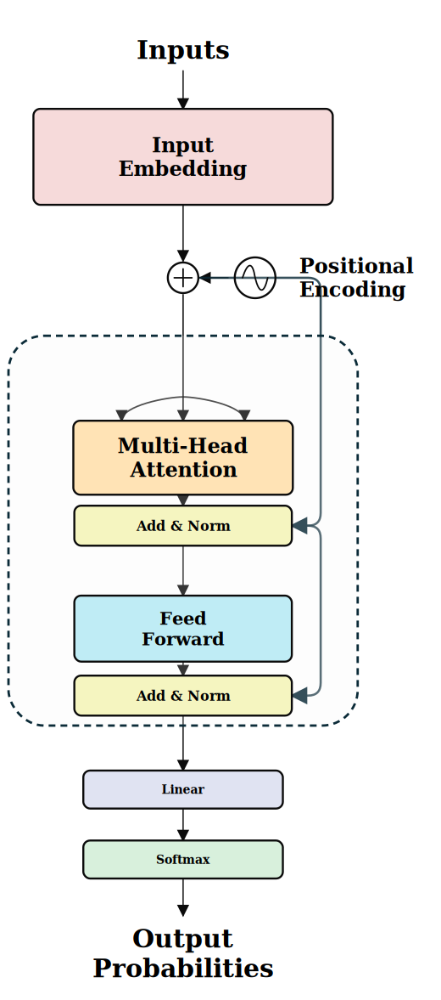
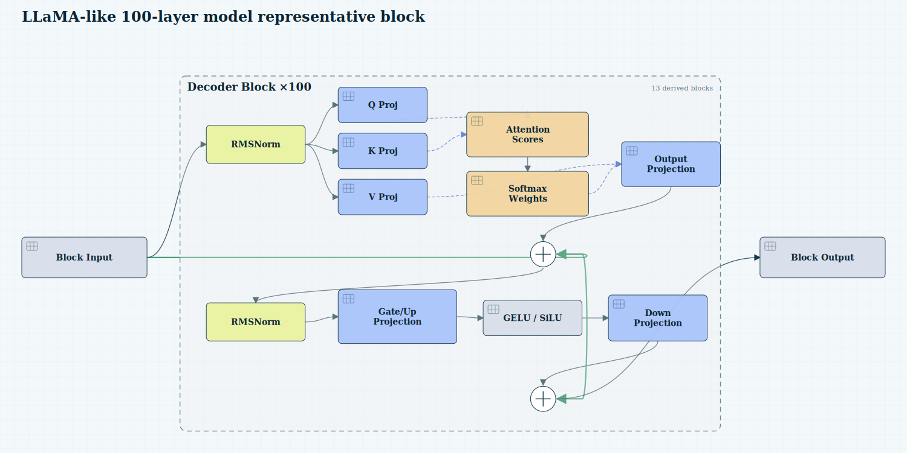

# @mappedinfo/llm-architecture-svg

Generate standalone SVG diagrams for Transformer-family/LLM architectures without model weights.

This package computes architecture layout, tensor shapes, and parameter counts. It does **not** load weights, run inference, or depend on React, DOM, Canvas, WebGL, or Next.js.

## Install

After the package is published to npm:

```bash
npm install @mappedinfo/llm-architecture-svg
```

Before the npm package exists, install directly from GitHub:

```bash
npm install github:Mappedinfo/llm-architecture-svg
```

## CLI quick start

Generate a compact GPT architecture SVG:

```bash
npx llm-architecture-svg \
  --preset gpt \
  --T 64 \
  --C 192 \
  --nHeads 3 \
  --nBlocks 3 \
  --vocabSize 1000 \
  --out artifacts/svg/gpt.svg
```

Expand one transformer block to show Q/K/V, attention scores, and MLP internals:

```bash
npx llm-architecture-svg \
  --preset gpt \
  --T 64 \
  --C 192 \
  --nHeads 3 \
  --nBlocks 3 \
  --vocabSize 1000 \
  --expand block_0 \
  --out artifacts/svg/gpt-expanded.svg
```

Batch export:

```bash
npx llm-architecture-svg --batch examples/llm-svg-batch.json --out artifacts/svg
```

Generate paper-style Transformer-family templates:

```bash
npx llm-architecture-svg --preset transformer --profile textbook-overview --out artifacts/svg/transformer.svg
npx llm-architecture-svg --preset bert --profile textbook-overview --out artifacts/svg/bert.svg
npx llm-architecture-svg --preset encoder-only --profile textbook-overview --out artifacts/svg/encoder-only.svg
npx llm-architecture-svg --preset decoder-only --profile textbook-overview --out artifacts/svg/decoder-only.svg
```

## Node API quick start

```ts
import { renderGptArchitectureSvg } from "@mappedinfo/llm-architecture-svg";
import { writeFileSync } from "node:fs";

const svg = renderGptArchitectureSvg({
  T: 64,
  C: 192,
  nHeads: 3,
  nBlocks: 3,
  vocabSize: 1000,
  bias: false,
  tieEmbeddings: true
}, {
  title: "Small GPT architecture",
  expandedGroups: ["block_0"],
  showShapes: true,
  showParamCounts: true
});

writeFileSync("gpt.svg", svg);
```

## Local demos

From this repository:

```bash
npm install
npm run demo:basic
npm run demo:expanded
npm run demo:custom
npm run demo:batch
```

The generated SVGs are written to `artifacts/demo/`.

## Playground

This repository includes a Vite + React playground that calls the package renderer directly instead of copying rendering logic into the website.

```bash
npm run site:dev
npm run site:build
```

The playground supports GPT template parameters, built-in figure presets, custom `LlmFigureSpec` JSON, profile switching, SVG export, SVG copy, and JSON download. GitHub Pages deployment is handled by `.github/workflows/pages.yml`.

## API

- `generateGptArchitecture(params)`
- `generateTransformerArchitecture(params)`
- `generateBertArchitecture(params)`
- `generateEncoderOnlyArchitecture(params)`
- `generateDecoderOnlyArchitecture(params)`
- `renderArchitectureSvg(spec, options)`
- `renderGptArchitectureSvg(params, options)`
- `createModelGraphFromHfConfig(config, options)`
- `modelGraphToArchitectureSpec(modelGraph, options)`
- `renderModelGraphSvg(modelGraph, options)`
- `countArchitectureParameters(spec)`
- `shapeToLabel(shape)`
- `validateGptTemplateParams(params)`

## Options

`renderArchitectureSvg(spec, options)` and `renderGptArchitectureSvg(params, options)` accept:

- `title`: SVG title text.
- `showShapes`: show inferred tensor shapes on nodes.
- `showParamCounts`: show parameter summary and per-node counts.
- `expandedGroups`: group ids to expand, for example `["block_0"]`.
- `theme`: `"paper"` or `"blueprint"`.
- `width`: SVG width in pixels.
- `padding`: outer padding in pixels.

## Parameter counting

The default GPT parameter counting follows nanoGPT-style defaults:

- `tieEmbeddings=true`
- `bias=false`

With tied embeddings, `lm_head` contributes `0` additional parameters because it shares token embedding weights. With untied embeddings, `lm_head` contributes `C * vocabSize`.

## More docs

- [Usage guide](docs/usage.md)
- [ArchitectureSpec guide](docs/architecture-spec.md)
- [ModelGraphSpec guide](docs/model-graph-spec.md)
- [Gallery and demo commands](docs/gallery.md)

## Two spec layers

- `ArchitectureSpec`: parameterized model-family templates with inferred tensor shapes and parameter counts. Use this for GPT, original Transformer, BERT, encoder-only, and decoder-only architecture SVGs.
- `ModelGraphSpec`: import-side model IR produced from HuggingFace config/module metadata or torch.fx debug traces. Use this when you want `PyTorch/HuggingFace -> semantic architecture -> SVG`.
- `LlmFigureSpec`: freeform LLM mechanism figures with manual coordinates. Use this for paper/PPT explanation diagrams such as KV indexing, n-gram embeddings, or custom teaching figures.

## PyTorch / HuggingFace model import

The optional Python tracer exports model structure as JSON. It does not store weights or run inference.

```bash
cd python
python -m pip install -e .
llm-arch-trace --config config.json --out ../artifacts/model-graph.json
cd ..
npx llm-architecture-svg --model-graph artifacts/model-graph.json --level overview --out artifacts/model-overview.svg
npx llm-architecture-svg --model-graph artifacts/model-graph.json --level representative-block --profile expanded-gpt-block --out artifacts/model-block.svg
```

For programmatic use without Python:

```ts
import { createModelGraphFromHfConfig, renderModelGraphSvg } from "@mappedinfo/llm-architecture-svg";

const graph = createModelGraphFromHfConfig({
  model_type: "llama",
  hidden_size: 4096,
  num_attention_heads: 32,
  num_hidden_layers: 100,
  vocab_size: 32000
}, { modelName: "LLaMA-like 100-layer model" });

const svg = renderModelGraphSvg(graph, { level: "overview", profile: "textbook-overview" });
```

## Teaching highlights

Use `presentation` to customize a diagram for teaching without changing the architecture. Overrides can target node ids, `derived.role`, or component kinds.

```ts
import { generateTransformerArchitecture, renderArchitectureSvg } from "@mappedinfo/llm-architecture-svg";

const spec = generateTransformerArchitecture(params);
const svg = renderArchitectureSvg(spec, {
  profile: "textbook-overview",
  presentation: {
    muteUnmatched: true,
    overrides: [{
      selector: { roles: ["cross_attention"] },
      fill: "#ffd166",
      stroke: "#ef476f",
      strokeWidth: 4,
      highlight: { badge: "1", glow: true },
      callout: "Encoder memory enters here"
    }]
  }
});
```

## Acknowledgements

This project is inspired by:

- [NN-SVG](https://alexlenail.me/NN-SVG/index.html), a browser-based tool for parametrically creating publication-ready neural network SVG schematics.
- [bbycroft/llm-viz](https://github.com/bbycroft/llm-viz), a detailed interactive GPT/LLM visualization that informed the broader architecture-explanation direction.
- [Mappedinfo/llm-viz](https://github.com/Mappedinfo/llm-viz), an interactive LLM visualization project that motivated the LLM architecture and explanation-figure workflow here.

## Gallery

Common Transformer-family architecture and mechanism figures are generated by this package and committed as standalone SVG assets. See the [full gallery](docs/gallery.md).

| Original Transformer | BERT encoder |
| --- | --- |
|  |  |

| GPT decoder | GPT expanded internals |
| --- | --- |
|  |  |

| LSA KV indexing | N-gram embedding |
| --- | --- |
|  |  |

| Teaching highlight | Cross-attention highlight |
| --- | --- |
|  |  |

| Imported model overview | Representative block |
| --- | --- |
|  |  |

## 中文说明

这个包只生成解释图：它不会保存模型权重、不会导入权重、不会执行推理。它根据 GPT 超参数推导 block、tensor shape 和参数量，然后输出可直接放进论文、PPT 或网页的 standalone SVG。

## Profile-based styles

The renderer supports profile presets so diagram intent can be selected with one option instead of many low-level style flags.

```ts
import { renderGptArchitectureSvg } from "@mappedinfo/llm-architecture-svg";

const svg = renderGptArchitectureSvg(params, {
  profile: "textbook-overview"
});
```

Built-in profiles:

| Profile | Use case |
| --- | --- |
| `textbook-overview` | Narrow paper-style Transformer concept diagram with `+` circle, sine positional icon, rounded attention fan-in arrows, right-side residual loops, no grid, and no shape/parameter labels. |
| `gpt-overview` | Clean GPT architecture overview with shape and parameter summaries. |
| `expanded-gpt-block` | Expands `block_0` and shows Q/K/V, attention scores/probs, and MLP internals. |
| `teaching-debug` | Shows expected-vs-actual shape mismatch warnings for teaching/debugging. |
| `slide-dark` | High-contrast dark style for slides and videos. |

CLI examples:

```bash
npx llm-architecture-svg --preset gpt --profile textbook-overview --out artifacts/svg/textbook.svg
npx llm-architecture-svg --preset gpt --profile expanded-gpt-block --out artifacts/svg/expanded.svg
npx llm-architecture-svg --preset gpt --profile slide-dark --out artifacts/svg/slide-dark.svg
```

Backward compatibility: `--theme paper` and `--theme blueprint` still work. Prefer `--profile` for new diagrams.

Generate all profile demos locally:

```bash
npm run demo:profiles
```

## Publishing

This repository is configured for public npm publishing as `@mappedinfo/llm-architecture-svg`.

Manual first publish:

```bash
npm login
npm whoami
npm run typecheck
npm run build
npm pack --dry-run
npm publish --access public
```

Automated publish uses GitHub Actions:

- Workflow: `.github/workflows/publish.yml`
- Triggers: GitHub Release published, or manual `workflow_dispatch`
- Required GitHub secret: `NPM_TOKEN`
- Publish command: `npm publish --access public --provenance`

To enable it, create an npm token with publish permission, then add it in GitHub:

```text
GitHub repository -> Settings -> Secrets and variables -> Actions -> New repository secret
Name: NPM_TOKEN
Value: <your npm token>
```

For each release, update the package version first:

```bash
npm version patch
git push --follow-tags
```

Then publish a GitHub Release for that tag, or run the `Publish to npm` workflow manually. npm will reject publishing the same `name@version` twice.

## LLM mechanism figures

In addition to GPT architecture diagrams, the package can render standalone LLM mechanism explanation figures through `LlmFigureSpec`.

Built-in figure presets:

```bash
npx llm-architecture-svg --figure-preset lsa-kv-indexing --out artifacts/svg/lsa.svg
npx llm-architecture-svg --figure-preset ngram-embedding --out artifacts/svg/ngram.svg
```

Node API:

```ts
import { renderLsaKvIndexingFigure, renderNgramEmbeddingFigure } from "@mappedinfo/llm-architecture-svg";

const lsaSvg = renderLsaKvIndexingFigure();
const ngramSvg = renderNgramEmbeddingFigure();
```

The figure renderer supports token rows, token stacks, stacked process cards, selector trapezoids, indexer blocks, dashed windows, group boxes, plus-circle sum nodes, annotations, and manually routed edges. See [LlmFigureSpec guide](docs/llm-figure-spec.md).
