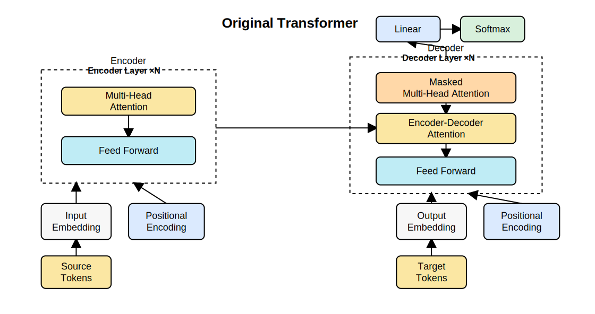
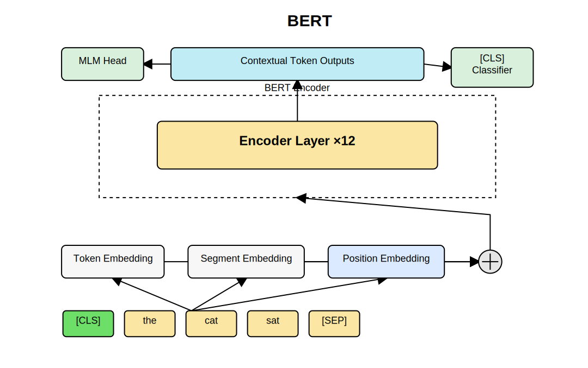
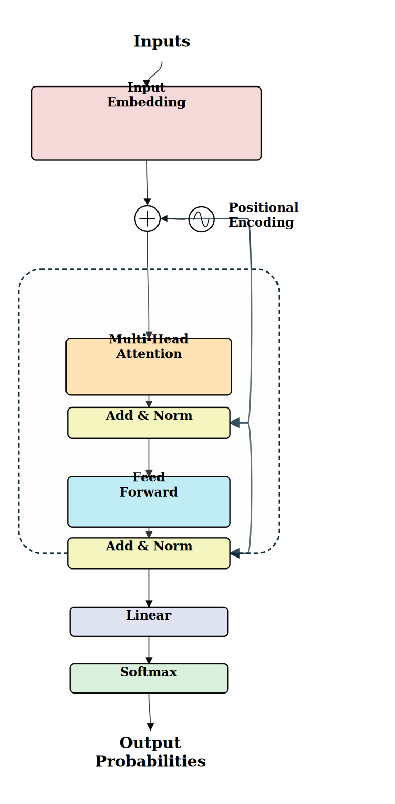
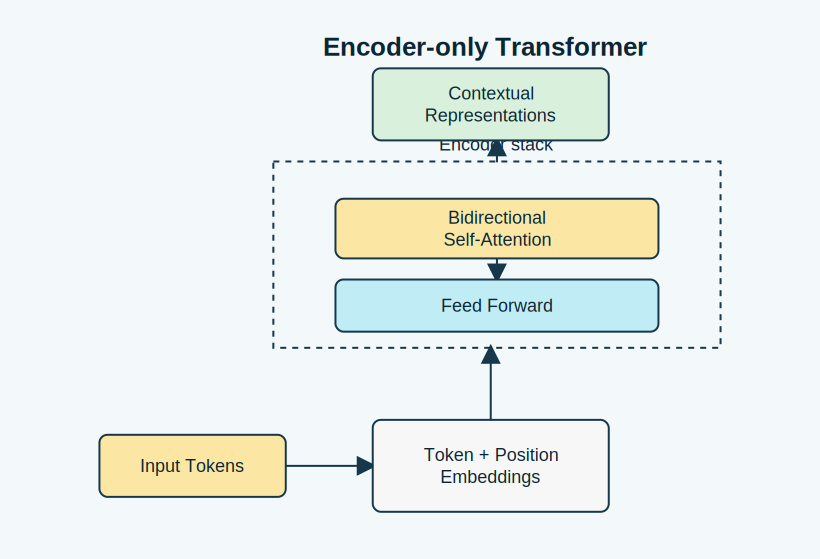
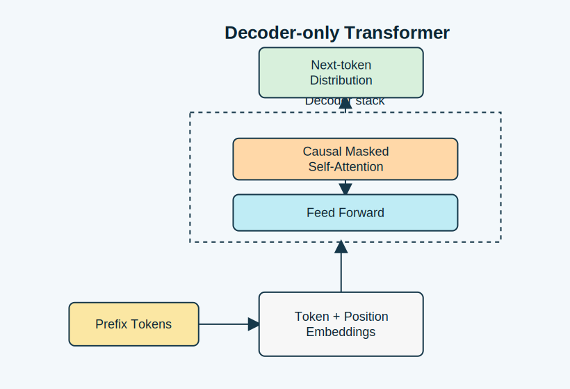
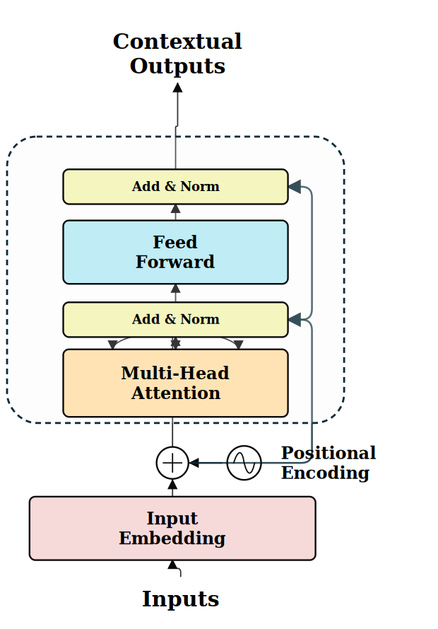
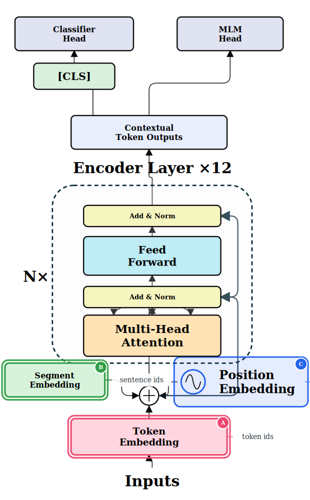
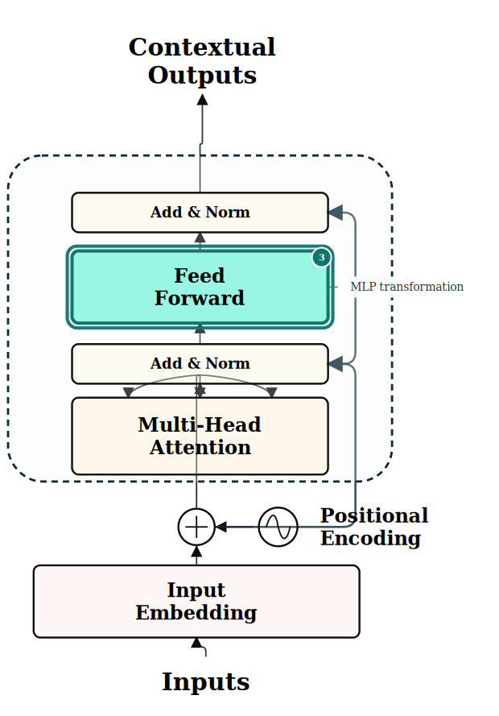
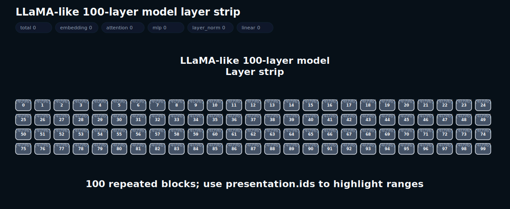
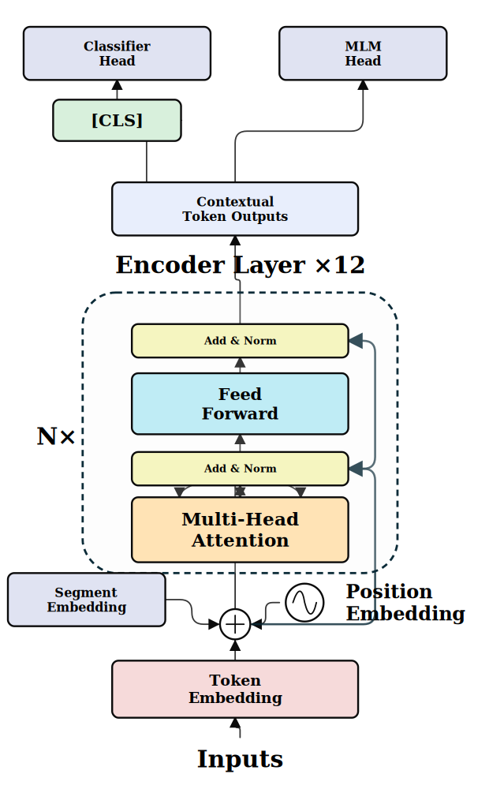

# Gallery

This gallery is generated with this package itself. The SVG files are committed under `docs/assets/gallery/` so GitHub can render them directly.

Run the full gallery generator:

```bash
npm run demo:gallery
```

## Common Transformer architectures

### Original Transformer encoder-decoder




```bash
npm run export -- --preset transformer --profile textbook-overview --out docs/assets/gallery/transformer-textbook-overview.svg
npm run export -- --figure-preset transformer-paper --profile architecture-paper --out docs/assets/gallery/transformer-paper-architecture-paper.svg
npm run export -- --figure-preset transformer-paper --profile architecture-blueprint --out docs/assets/gallery/transformer-paper-blueprint.svg
```

### BERT encoder




```bash
npm run export -- --preset bert --profile textbook-overview --out docs/assets/gallery/bert-textbook-overview.svg
npm run export -- --figure-preset bert-encoder --profile architecture-paper --out docs/assets/gallery/bert-encoder-architecture-paper.svg
npm run export -- --figure-preset bert-encoder --profile architecture-dark --out docs/assets/gallery/bert-encoder-architecture-dark.svg
```

### GPT decoder-only architecture


```bash
npm run export -- --figure-preset gpt-decoder --profile architecture-paper --out docs/assets/gallery/gpt-decoder-architecture-paper.svg
npm run export -- --figure-preset gpt-decoder --profile architecture-dark --out docs/assets/gallery/gpt-decoder-architecture-dark.svg
```

### GPT internals and textbook overview




```bash
npm run export -- --preset gpt --profile expanded-gpt-block --out docs/assets/gallery/gpt-expanded-blueprint.svg
npm run export -- --preset gpt --profile textbook-overview --out docs/assets/gallery/gpt-textbook-overview.svg
npm run export -- --preset decoder-only --profile textbook-overview --out docs/assets/gallery/decoder-only-textbook-overview.svg
```

### Encoder-only vs decoder-only teaching views







```bash
npm run export -- --preset encoder-only --profile textbook-overview --out docs/assets/gallery/encoder-only-textbook-overview.svg
npm run export -- --figure-preset encoder-only --profile architecture-blueprint --out docs/assets/gallery/encoder-only-comparison.svg
npm run export -- --figure-preset decoder-only --profile architecture-blueprint --out docs/assets/gallery/decoder-only-comparison.svg
```

## Teaching highlights

### GPT attention highlighted


### Transformer cross-attention highlighted


### BERT embedding components highlighted



### Encoder feed-forward highlighted



## Imported model graphs

These figures are generated from `ModelGraphSpec` objects created from HuggingFace-style config dictionaries. A 100-layer decoder is compressed rather than rendered as 100 large blocks.






```bash
npm run demo:model-graph
npm run export -- --model-graph artifacts/model-graph.json --level overview --out artifacts/svg/model-overview.svg
```

## Mechanism figures

### LSA KV indexing


```bash
npm run export -- --figure-preset lsa-kv-indexing --profile paper-algorithm --out docs/assets/gallery/lsa-kv-indexing-paper.svg
```

### N-gram embedding fusion


```bash
npm run export -- --figure-preset ngram-embedding --profile drawio-mechanism --out docs/assets/gallery/ngram-embedding-drawio.svg
```

## Gallery asset list

```text
docs/assets/gallery/transformer-paper-architecture-paper.svg
docs/assets/gallery/transformer-paper-blueprint.svg
docs/assets/gallery/bert-encoder-architecture-paper.svg
docs/assets/gallery/bert-encoder-architecture-dark.svg
docs/assets/gallery/gpt-decoder-architecture-paper.svg
docs/assets/gallery/gpt-decoder-architecture-dark.svg
docs/assets/gallery/gpt-expanded-blueprint.svg
docs/assets/gallery/gpt-textbook-overview.svg
docs/assets/gallery/transformer-textbook-overview.svg
docs/assets/gallery/bert-textbook-overview.svg
docs/assets/gallery/encoder-only-textbook-overview.svg
docs/assets/gallery/decoder-only-textbook-overview.svg
docs/assets/gallery/gpt-attention-highlight.svg
docs/assets/gallery/transformer-cross-attention-highlight.svg
docs/assets/gallery/bert-embeddings-highlight.svg
docs/assets/gallery/encoder-ffn-highlight.svg
docs/assets/gallery/llama-modelgraph-overview.svg
docs/assets/gallery/llama-modelgraph-representative-block.svg
docs/assets/gallery/llama-modelgraph-layer-strip.svg
docs/assets/gallery/bert-modelgraph-overview.svg
docs/assets/gallery/encoder-only-comparison.svg
docs/assets/gallery/decoder-only-comparison.svg
docs/assets/gallery/lsa-kv-indexing-paper.svg
docs/assets/gallery/ngram-embedding-drawio.svg
```

## Older demo scripts

These scripts still generate examples into ignored `artifacts/` paths:

```bash
npm run demo:basic
npm run demo:expanded
npm run demo:custom
npm run demo:profiles
npm run demo:figures
npm run demo:batch
```
